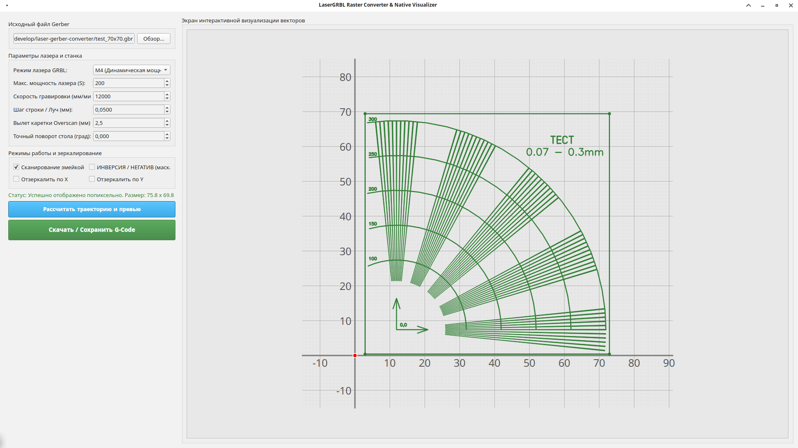
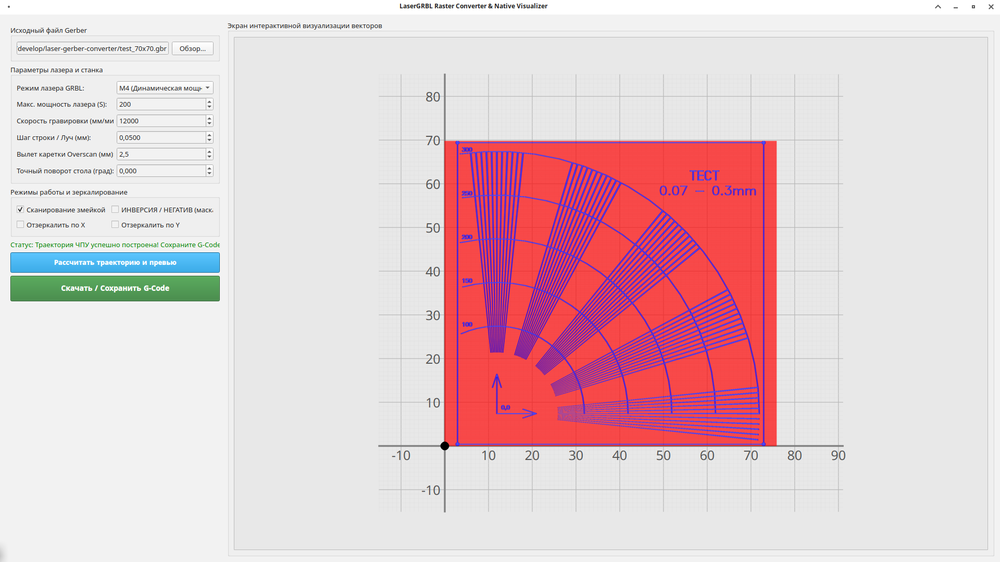

# LaserGRBL Raster Converter & Native Visualizer

Интерактивное графическое приложение на **PyQt6** для конвертации чертежей печатных плат из формата **Gerber (.gbr)** в управляющий **G-Code** для лазерных ЧПУ-станков (под управлением прошивок GRBL/Marlin).

Программа выполняет растровое сканирование векторов, поддерживает режим негатива (инверсии) для создания масок плат, точный поворот стола и зеркалирование.

## 🚀 Основные возможности

* **Высокоскоростная визуализация:** Отображение проводников печатной платы в реальном времени с интерактивной миллиметровой сеткой и осями координат.
* **Двусторонний Overscan:** Симметричный вылет лазерной каретки слева и справа от платы для плавного разгона и торможения ЧПУ без выжигания краев.
* **Режимы работы лазера:** Поддержка команд управления мощностью `M4` (динамическая мощность GRBL) и `M3` (постоянная мощность).
* **Гравировка «Змейкой»:** Оптимизация траектории за счет смены направления сканирования на каждой строке (экономит время работы станка).
* **Режим НЕГАТИВ / ИНВЕРСИЯ:** Автоматическое вырезание изоляционных дорожек (идеально для фоторезиста или прямого лазерного выжигания маски).
* **Трансформация:** Зеркалирование по осям X/Y и точный поворот геометрии на любой угол.

## 🛠 Зависимости и требования

Для работы скрипта требуются следующие компоненты:
1. **Python 3.10 или выше**
2. **Внешние библиотеки:**
   * `PyQt6` — для графического интерфейса и рендеринга.
   * `shapely` — для точных геометрических расчетов пересечений векторов.

*Обратите внимание: проект использует внутренний локальный модуль `gerbyx` для парсинга Gerber-файлов. Он должен находиться в корневой директории скрипта.*

## 📦 Установка

1. Склонируйте репозиторий с проектом:
   ```bash
   git clone https://github.com/gitlog/laser-gerber-converter.git
   cd laser-gerber-converter
   ```

2. Установите необходимые зависимости с помощью `requirements.txt`:
   ```bash
   pip install -r requirements.txt
   ```

## 💻 Запуск приложения

Запустите главный файл скрипта (например, `main.py` или имя вашего файла):

```bash
python main.py
```

## 📐 Инструкция по использованию

1. Нажмите кнопку **«Обзор...»** и выберите ваш Gerber-файл (`.gbr` или `.pho`). Плата сразу отобразится на интерактивном холсте.
2. Используйте **колесико мыши** для масштабирования (зума) и **зажмите левую кнопку мыши** для перемещения по рабочей зоне.
3. Настройте параметры вашего станка в левой панели:
   * **Шаг строки (мм):** задает толщину луча лазера и разрешение гравировки.
   * **Вылет каретки Overscan (мм):** зона безопасности для разгона головки за пределами платы.
4. Нажмите **«Рассчитать траекторию и превью»**:
   * Синим цветом на холсте отобразятся линии рабочего хода лазера.
   * Красным цветом — траектории холостого перемещения и оверскана.
5. Нажмите кнопку **«Скачать / Сохранить G-Code»**, чтобы получить готовый файл для LaserGRBL или Universal Gcode Sender.

## 📝 Лицензия

Проект распространяется под лицензией MIT. Вы можете свободно использовать и модифицировать данный код.

<details>
  <summary>📷 Посмотреть скриншот</summary>
  
  
</details>